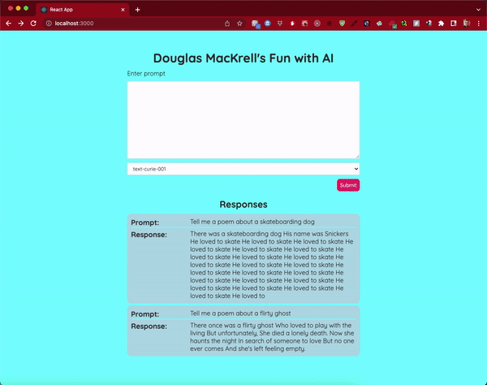

# Douglas MacKrell's Fun with AI

## Live @ [dougs-fun-with-ai.herokuapp.com](https://dougs-fun-with-ai.herokuapp.com)

[](https://beholdburrito.herokuapp.com/)

**Douglas MacKrell's Fun with AI** is a Full Stack Web App created to consume the OpenAI API and allow a user to quickly query a quirky AI and store their previous prompts in the browser!

[](https://dougs-fun-with-ai.herokuapp.com/)

## Features

Users are able to:

* Provide a prompt for OpenAI to respond to
* Select an available engine for (possibly) better text results
* Submit a prompt
* Receive a reply in the form of a ResponseCard that showcases their prompt and the given response
* Previous ResponseCards are saved locally in browser, and will not clear on refresh/reload

This is accomplished by:

* Updating and saving the value of the prompt box's textarea to state in order to capture the user's input
* Filling the select box with engine options based on a GET request made to the OpenAI API
  * This is facilitated through an Express.js back-end in the interest of keeping my sensitive API Key from being commited to GitHub or exposed in the build of my React App
    * The dotenv package allows the use of a hidden environmental variable
  * The response is mapped over, and each engine id is saved as a string in an array which is saved to state
  * This array of engine names is mapped over in my primary App function which creates options for the select box assigning the unique name as the value, key, and innerHTML of each
  * To save on unnecessary, costly, and slow GET requests to this mostly static data, the array of engine names is also saved to sessionStorage for quick retrieval by the browser
* Using both the user generated prompt and the selected engine name to form the desired POST request to the OpenAI API
   * This is also facilitated through an Express.js back-end in the interest of keeping my sensitive API Key from being commited to GitHub or exposed in the build of my React App
   * The state of the captured prompt box value and selected engine name are sent as props to the backend where they are used to form an axios POST request
   * The current response is captured within an object and amended to the front of the growing history array held in state, thereby ensuring the topmost prompt/response displayed to the user is the most current
   * This is also saved in sessionStorage upon update, and ensures that previous prompts/responses are saved within the browser and not lost upon refresh or accidental reload  
* Using a reusable ResponseCard component, the history array is mapped over on update and creates individual ResponseCards for every prompt/response returned by the OpenAI API
* A loading state is toggled between when POST requests are made to and returned from the OpenAI API 
  * This temporarily reveals a circular loading spinner crafted in pure CSS3

## Future Features

* Updated styling to fade-in each newly created ResponseCard for a better UX
* Deeper unit testing to cover all aspects of the single page application

## Technical Milestones

* Utilizing the OpenAI API for the first time
  * Dynamically revealing all current engines offered by the API via GET request
  * Dynamically requesting a text response based on the response to a POST request
  * Reading the OpenAI API [documentation](https://beta.openai.com/docs/introduction/overview) 
* Implementing sessionStorage to save unnecessary API calls, and improve UX
* Implementing unit testing of App.js and LoadingView via jest
* Setting sensitive data within environmental variables in Heroku deployment

## Technologies Used

* **Node.js & Express.js** For the HTTP backend server
* **React.js** For the front-end/client interface of my app
* **OpenAI API** To handle all data requests
* **SCSS** For greater control and cleaner implementation of styling
* **Heroku** For deployment
* **Jest** For unit testing

## Local Setup

**NOTE: This repo has been configured for deployment on Heroku, but can be run locally after a few adjustments.**

You must install [Node.js](https://nodejs.org) in your computer.

If you're unsure if you have Node installed, you can check for Node dependencies with `node -v`. If your shell/terminal doesn't complain and you see version numbers you are good to go!

1. Clone this repo into a folder of your choice:
    ```
    git clone https://github.com/DouglasMacKrell/shopify-frontend-challenge.git
    ```

2. Install dependencies for the Node/Express Server and React App:
    ```
    cd front-end && npm install && cd .. && cd server && npm install
    ```

3. Before you can launch the Node/Express server, you must first create a free account with [OpenAI API](https://beta.openai.com/signup). Once you have created your account and verified your email, copy your API Key [from here](https://beta.openai.com/account/api-keys), and create an `.env` file in the root of the `front-end' folder. Inside this new file, add:
    ```
    REACT_APP_OPENAI_SECRET=[paste your API key here]
    ```

4. To launch the Node/Express server, inside the `server` folder run:
    ```
    npm start
    ```

5. Before you can launch the React App, you must target your local server instead of my personal deployment within App.js. In the `front-end` => `src` folder, open the `App.js` file, and make the following updates:

    - On line 27, change  
        ```
        `https://dougs-fun-with-ai.herokuapp.com/api/engines`
        ```

    - to  
        ```
        'http://localhost:3001/api/engines'
        ```

    - And on line 42, change  
        ```
        `https://dougs-fun-with-ai.herokuapp.com/api/prompt`
        ```

    - to  
        ```
        'http://localhost:3001/api/prompt'
        ```


6. To launch the React App, from a new terminal window starting at the `root` folder of the app run:
    ```
    cd front-end && npm start
    ```

7. A new browser tab should have been opened and the App should be running locally on your device. If that is not the case check the terminal's output for errors. If you are unable to troubleshoot the problem, I would be happy to address issues - so please open one [here!](/issues)


---

### Please check out my other work at [DouglasMacKrell.com](https://douglasmackrell.com)

---

[](https://dougmackrell.com)

** **

<details>
    <summary>
        Before you leave, please take note:
    </summary>

You're the best! Thank you for visiting!

Please give this project a star and be sure to check out my [YouTube Channel](https://youtube.com/BigMacKrell)!

</details>
